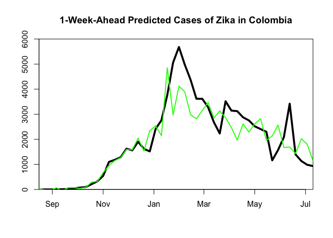
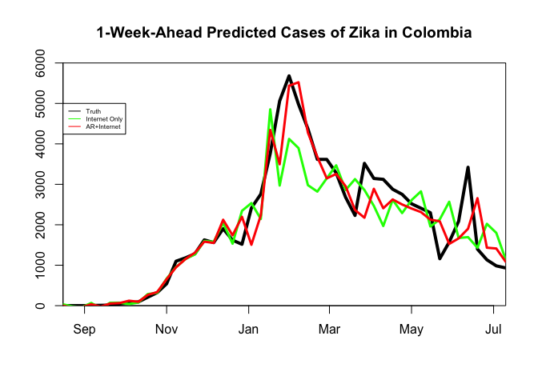

Using Digital Data to Predict Zika
================
Sarah McGough
3/1/2018

``` r
library(ggplot2)
library(dplyr)
library(tidyr)
library(glmnet)
library(lubridate)
```

### Introduction

It has been shown that linear combinations of key Google search phrases can be leveraged to predict the incidence of diseases such as influenza (Yang et al 2015) and dengue fever (Yang et al 2017). Let's see if we can do the same for Zika virus during the 2016 Latin American outbreak!

To give you an idea how this works, we'll try the method on one test country, Colombia.

We'll first load a pre-cleaned file that contains:

1.  Date- start day of the week of interest

2.  Cases- the number of cases suspected to have occurred during this week

3.  {26 search terms spelled exactly as they would have been entered into Google by a user}- Google search fraction

4.  "twitter", a variable denoting the combined Twitter hashtag frequency for Colombia (by week) of the terms "microcephaly," "microcefalia," and "zika"

5.  "healthmap", a variable indicating the reported number of cases by week as digitally media-sourced by the organization HealthMap.

``` r
setwd("/Users/sarah/Documents/Harvard/Year 4/R tutorials/Zika/")
case_data <- read.csv("Zika_Colombia_cleaned.csv")
head(case_data)
```

    ##      date cases     zika sintomas zika.sintomas  el.zika sintomas.del.zika
    ## 1  8/9/15     1 55.60883 7865.916     15.141586 26.38465          7.570793
    ## 2 8/16/15     1 42.23969 7894.307      7.551660 11.88330          7.551660
    ## 3 8/23/15     1 37.41108 7687.968      7.551660 13.48461          7.551660
    ## 4 8/30/15     0 52.95346 8052.025      7.574054 15.08592         11.292498
    ## 5  9/6/15     5 40.08811 8042.778     11.279599 22.59338         15.033335
    ## 6 9/13/15     8 62.68083 7681.835      7.555335 15.04458          7.574218
    ##   virus.zika    virus zika.colombia que.es.zika virus.del.zika  el.sika
    ## 1   32.84607 3738.248     15.160137    7.570793       18.86231 25.26259
    ## 2   27.67048 3790.098      7.910434    7.920604       23.73130 11.89144
    ## 3   27.43715 4289.603     11.209173    7.574054       15.10332 11.17497
    ## 4   30.28198 4206.382     15.024439    7.574054       12.60440 20.16918
    ## 5   22.55945 4047.598     15.062253    9.428177       11.27960 33.87632
    ## 6   32.59227 4181.783     15.148436   11.282300       15.14844 20.06460
    ##   el.zika.sintomas sintomas.de.zika zika.embarazo zika.microcefalia
    ## 1         7.570793                0             0                 0
    ## 2         0.000000                0             0                 0
    ## 3         0.000000                0             0                 0
    ## 4         0.000000                0             0                 0
    ## 5         0.000000                0             0                 0
    ## 6         0.000000                0             0                 0
    ##   zika.sintomas.colombia zika.fiebre     sika sintomas.del  el.sica
    ## 1               7.570793    9.804828 361.4218     1546.745 42.97376
    ## 2               7.551660   11.544699 319.3808     1636.399 55.42535
    ## 3               7.551660   13.284569 354.3897     1624.318 52.38135
    ## 4               7.559179   15.024439 327.8168     1601.229 45.41689
    ## 5               7.566699   16.830852 353.0073     1579.649 67.58527
    ## 6               7.574218   18.637264 338.7032     1598.211 60.17567
    ##   zika.repite    twitter healthmap
    ## 1           0 7.3576e-05         0
    ## 2           0 2.2527e-05         0
    ## 3           0 2.4285e-05         0
    ## 4           0 5.1018e-05         0
    ## 5           0 2.4378e-05         0
    ## 6           0 4.9411e-05         0

``` r
case_data$date <- mdy(case_data$date) # Format the date properly
```

Since we are focused on *predicting* cases out-of-sample, we do *not* want our data to exhibit what we call "forward-looking bias." This means that the list of relevant search terms was collected *prior* to the week in which predictions were first generated. In other words, we gathered the terms based on their relevance during the training period exclusively, which we defined to be the first 17 weeks of the epidemic.

(An aside: prediction modeling generally divides the dataset in two halves, the first for training on the observed outcome, and the second for producing out-of-sample predictions without "seeing" the observed outcome. We will be training our model on a one-week-expanding training window, which means that each prediction incorporates the most recent information, up until the week of the prediction).

Let's take a look at how these Google search terms, Twitter hashtags, and HealthMap-reported cases - which we will use as our *predictors* for this model - relate to our outcome of interest: weekly cases.

To give an example of how to do this for a suspected linear relationship, we'll examine the Pearson's correlation between weekly cases and one predictor of interest, the Google search term "sintomas del zika."

``` r
cor(case_data$cases[1:20], case_data$sintomas.del.zika[1:20]) # in the training weeks
```

    ## [1] 0.9293926

``` r
cor(case_data$cases, case_data$sintomas.del.zika) # in full dataset
```

    ## [1] 0.861103

We can try a square-root transform to see if this improves the relationship.

``` r
cor(case_data$cases, sqrt(case_data$sintomas.del.zika)) # in full dataset
```

    ## [1] 0.9318803

Let's plot the relationship between the search term "Sintomas del Zika" and cases for each week of the epidemic. 

What does the relationship look like to you?

### The Model

We will build a simple but powerful linear regression model (an example of a *supervised learning* model in machine learning lingo) that takes into account 1) the Zika-related Google search terms and 2) autoregressive case counts (it is good to make the model keep track of how many cases were realized in the few weeks prior). The relationship between Zika-related search terms and reported Zika cases will be explored synchronously - per the good synchronous relationship we observed in the correlations - which suits our paper's goals of producing good near-real-time predictions weeks ahead of the release of official Ministry of Health reports. In order to produce further-ahead real-time predictions, we would lag the relationship between searches and cases by some week(s), at the sacrifice of some accuracy.

Some features of the model:

-   Dynamic variable transformation

-   Automatic feature selection (L1 regularization)

-   Out-of-sample predictions of new Zika cases (up to 3 weeks ahead) on a 1-week expanding training window

What this means is that our model:

-   Assesses and chooses the best linear fit of the predictors based on a series of linear data transformations

-   Retains only the most important predictors each week, and discards the rest as noise (LASSO)

-   Continually updates each week with the most current information, to produce a prediction for the following week

For this tutorial, we will look at predictions generated 1 week ahead.

First, some data prep: we will lag the case data by 1 week (giving us, for each week, a measure of last week's case count), and remove the first week of the data so that we can observe only complete rows of data (the first week contains an NA for the lag term). We'll then turn the predictors into a matrix of X covariates (Google predictors + lag terms) and a matrix of the Y outcome (cases).

``` r
# Create autoregressive terms: 1-3 week lag
case_data$lag_1 <- lag(case_data$cases, 1)

head(case_data) # note the NAs due to lagging the data
```

    ##         date cases     zika sintomas zika.sintomas  el.zika
    ## 1 2015-08-09     1 55.60883 7865.916     15.141586 26.38465
    ## 2 2015-08-16     1 42.23969 7894.307      7.551660 11.88330
    ## 3 2015-08-23     1 37.41108 7687.968      7.551660 13.48461
    ## 4 2015-08-30     0 52.95346 8052.025      7.574054 15.08592
    ## 5 2015-09-06     5 40.08811 8042.778     11.279599 22.59338
    ## 6 2015-09-13     8 62.68083 7681.835      7.555335 15.04458
    ##   sintomas.del.zika virus.zika    virus zika.colombia que.es.zika
    ## 1          7.570793   32.84607 3738.248     15.160137    7.570793
    ## 2          7.551660   27.67048 3790.098      7.910434    7.920604
    ## 3          7.551660   27.43715 4289.603     11.209173    7.574054
    ## 4         11.292498   30.28198 4206.382     15.024439    7.574054
    ## 5         15.033335   22.55945 4047.598     15.062253    9.428177
    ## 6          7.574218   32.59227 4181.783     15.148436   11.282300
    ##   virus.del.zika  el.sika el.zika.sintomas sintomas.de.zika zika.embarazo
    ## 1       18.86231 25.26259         7.570793                0             0
    ## 2       23.73130 11.89144         0.000000                0             0
    ## 3       15.10332 11.17497         0.000000                0             0
    ## 4       12.60440 20.16918         0.000000                0             0
    ## 5       11.27960 33.87632         0.000000                0             0
    ## 6       15.14844 20.06460         0.000000                0             0
    ##   zika.microcefalia zika.sintomas.colombia zika.fiebre     sika
    ## 1                 0               7.570793    9.804828 361.4218
    ## 2                 0               7.551660   11.544699 319.3808
    ## 3                 0               7.551660   13.284569 354.3897
    ## 4                 0               7.559179   15.024439 327.8168
    ## 5                 0               7.566699   16.830852 353.0073
    ## 6                 0               7.574218   18.637264 338.7032
    ##   sintomas.del  el.sica zika.repite    twitter healthmap lag_1
    ## 1     1546.745 42.97376           0 7.3576e-05         0    NA
    ## 2     1636.399 55.42535           0 2.2527e-05         0     1
    ## 3     1624.318 52.38135           0 2.4285e-05         0     1
    ## 4     1601.229 45.41689           0 5.1018e-05         0     1
    ## 5     1579.649 67.58527           0 2.4378e-05         0     0
    ## 6     1598.211 60.17567           0 4.9411e-05         0     5

``` r
# We'll filter to observable data (no NAs due to lags)
case_data <- case_data %>% filter(date>"2015-08-09") # start 1 week in

X_matrix <- as.matrix(case_data[,c(3:ncol(case_data))]) # Choose only the predictors (which start in column 3)
Y_matrix <- as.matrix(case_data[,2])
```

Now, we can run the model. We'll start with a model that uses only digital data sources (Google, Twitter, and HealthMap).

``` r
predictions_1wk <- NULL
coefficients <- NULL

n <- length(case_data$cases)
k <- 17

for(i in k:(n-1)) {
  sub_X <- X_matrix[1:(i+1),1:(ncol(X_matrix)-1)]
  sub_Y <- Y_matrix[1:(i+1),]
 
  #####################################
  ######## Data transformation ########
  #####################################
  transforms <- cbind(apply(sub_X[1:i,], 2, cor, x = sub_Y[1:i]),
              apply(sqrt(sub_X[1:i,]), 2, cor, x = sub_Y[1:i]),
                    apply(log(sub_X[1:i,]), 2, cor, x = sub_Y[1:i]))
  
  transforms[is.na(transforms)] <- 0
  
  sub_X[,which(max.col(transforms, 'first')==2,arr.ind=T)] <- apply(sub_X[,which(max.col(transforms, 'first')==2,arr.ind=T)], 2, function(x) sqrt(x))
  
  if(length(which(max.col(transforms, 'first')==3,arr.ind=T))>1){
    sub_X[,which(max.col(transforms, 'first')==3,arr.ind=T)] <- apply(sub_X[,which(max.col(transforms, 'first')==3,arr.ind=T)], 2, function(x) log(x))
  } else {
    sub_X[,which(max.col(transforms, 'first')==3,arr.ind=T)] <- log(sub_X[,which(max.col(transforms, 'first')==3,arr.ind=T)])
  }

  #####################################
  ###### 1 week ahead prediction ######
  #####################################
  
  X_train <- sub_X[1:i,]
  Y_train <- sub_Y[1:i]
  fit <- glmnet(X_train, Y_train, family="gaussian")
  set.seed(14)
  cvfit <- cv.glmnet(X_train, Y_train, family = "gaussian",nfolds=5)
  opt.lam <- cvfit$lambda.min 
  
  if (i==(k)){ # get fitted values for the training period
    predictions_1wk <- data.frame(rbind(predictions_1wk, predict(fit, newx=X_train, type="response",s=opt.lam)))
  }
  
  X_test <- sub_X[(i):(i+1),] # the test set
  predictions_1wk <- data.frame(rbind(predictions_1wk,predict(fit, newx=X_test, type="response",s=opt.lam)[2])) # predict next week
  coefficients <- cbind(coefficients,coef(cvfit, s=opt.lam))
  
} 
```

All done! Time to look at your predictions

``` r
names(predictions_1wk)[1] <- "predictions"
predictions_1wk$dates <- case_data[1:(n),1]
print(predictions_1wk)
```

    ##    predictions      dates
    ## 1     31.50583 2015-08-16
    ## 2    -17.50335 2015-08-23
    ## 3    -38.73477 2015-08-30
    ## 4     66.82240 2015-09-06
    ## 5    -70.73918 2015-09-13
    ## 6     71.76225 2015-09-20
    ## 7     73.29597 2015-09-27
    ## 8     39.94666 2015-10-04
    ## 9     77.23007 2015-10-11
    ## 10   287.21422 2015-10-18
    ## 11   317.66948 2015-10-25
    ## 12   669.06257 2015-11-01
    ## 13   954.46184 2015-11-08
    ## 14  1152.21930 2015-11-15
    ## 15  1267.15828 2015-11-22
    ## 16  1599.53116 2015-11-29
    ## 17  1579.09729 2015-12-06
    ## 18  2045.87357 2015-12-13
    ## 19  1532.59028 2015-12-20
    ## 20  2344.72911 2015-12-27
    ## 21  2536.44694 2016-01-03
    ## 22  2143.45710 2016-01-10
    ## 23  4853.46721 2016-01-17
    ## 24  2970.24109 2016-01-24
    ## 25  4122.22321 2016-01-31
    ## 26  3896.46943 2016-02-07
    ## 27  2979.51940 2016-02-14
    ## 28  2820.12680 2016-02-21
    ## 29  3148.07820 2016-02-28
    ## 30  3469.34252 2016-03-06
    ## 31  2857.75392 2016-03-13
    ## 32  3128.80563 2016-03-20
    ## 33  2859.42789 2016-03-27
    ## 34  2467.59236 2016-04-03
    ## 35  1970.10547 2016-04-10
    ## 36  2615.62534 2016-04-17
    ## 37  2288.92669 2016-04-24
    ## 38  2609.56023 2016-05-01
    ## 39  2825.77436 2016-05-08
    ## 40  1957.49941 2016-05-15
    ## 41  2133.58263 2016-05-22
    ## 42  2568.60145 2016-05-29
    ## 43  1673.06428 2016-06-05
    ## 44  1694.49473 2016-06-12
    ## 45  1431.86702 2016-06-19
    ## 46  2023.22141 2016-06-26
    ## 47  1799.86400 2016-07-03
    ## 48  1138.99368 2016-07-10

We can also plot our predictions against the true case counts by week.

``` r
plot(case_data$date, case_data$cases, type="l", axes=T, xlab=NA, ylab=NA, col="black", ylim=c(0,6000),xaxs="i", yaxs="i", lwd=4, main="1-Week-Ahead Predicted Cases of Zika in Colombia")
par(new=T)
plot(as.Date(predictions_1wk$dates), predictions_1wk$predictions, type="l", axes=F, xlab=NA, ylab=NA, col="green", lwd=2,xaxs="i", yaxs="i",ylim=c(0,6000),xlim=c(as.numeric(as.Date(case_data$date[1])),(as.numeric(as.Date(case_data$date[n])))))
```



**So: these predictions are not the greatest.** As it turns out, we could probably improve the number and nature of Google search terms included, but what we found in our paper was that *exclusively* using Google & other Internet-based data sources is better when predicting multiple weeks into the future (i.e. our 2-3 week forecasts). But for predictions only 1 week in advance, we suspect that autoregressive information (i.e. knowing how many cases occurred last year) could be a good way to calibrate things. We'll add in the autoregressive data to see if this improves the model forecasts.

``` r
predictions_1wk_ARGO <- NULL
coefficients_ARGO <- NULL

n <- length(case_data$cases)
k <- 17

for(i in k:(n-1)) {
  sub_X <- X_matrix[1:(i+1),]
  sub_Y <- Y_matrix[1:(i+1),]
 
  #####################################
  ######## Data transformation ########
  #####################################
  transforms <- cbind(apply(sub_X[1:i,], 2, cor, x = sub_Y[1:i]),
              apply(sqrt(sub_X[1:i,]), 2, cor, x = sub_Y[1:i]),
                    apply(log(sub_X[1:i,]), 2, cor, x = sub_Y[1:i]))
  
  transforms[is.na(transforms)] <- 0
  
  sub_X[,which(max.col(transforms, 'first')==2,arr.ind=T)] <- apply(sub_X[,which(max.col(transforms, 'first')==2,arr.ind=T)], 2, function(x) sqrt(x))
  
  if(length(which(max.col(transforms, 'first')==3,arr.ind=T))>1){
    sub_X[,which(max.col(transforms, 'first')==3,arr.ind=T)] <- apply(sub_X[,which(max.col(transforms, 'first')==3,arr.ind=T)], 2, function(x) log(x))
  } else {
    sub_X[,which(max.col(transforms, 'first')==3,arr.ind=T)] <- log(sub_X[,which(max.col(transforms, 'first')==3,arr.ind=T)])
  }

  #####################################
  ###### 1 week ahead prediction ######
  #####################################
  
  X_train <- sub_X[1:i,]
  Y_train <- sub_Y[1:i]
  fit <- glmnet(X_train, Y_train, family="gaussian")
  set.seed(14)
  cvfit <- cv.glmnet(X_train, Y_train, family = "gaussian",nfolds=5)
  opt.lam <- cvfit$lambda.min 
  
  if (i==(k)){ # get fitted values for the training period
    predictions_1wk_ARGO <- data.frame(rbind(predictions_1wk_ARGO, predict(fit, newx=X_train, type="response",s=opt.lam)))
  }
  
  X_test <- sub_X[(i):(i+1),] # the test set
  predictions_1wk_ARGO <- data.frame(rbind(predictions_1wk_ARGO,predict(fit, newx=X_test, type="response",s=opt.lam)[2])) # predict next week
  coefficients_ARGO <- cbind(coefficients_ARGO,coef(cvfit, s=opt.lam))
  
}  

# Some cleaning
names(predictions_1wk_ARGO)[1] <- "predictions"
predictions_1wk_ARGO$dates <- case_data[1:(n),1]
print(predictions_1wk_ARGO)
```

    ##     predictions      dates
    ## 1    -0.5998979 2015-08-16
    ## 2   -50.2061870 2015-08-23
    ## 3   -38.1914822 2015-08-30
    ## 4    34.6659623 2015-09-06
    ## 5   -23.9173962 2015-09-13
    ## 6    52.1633820 2015-09-20
    ## 7    63.8498599 2015-09-27
    ## 8   122.1042905 2015-10-04
    ## 9    96.5869882 2015-10-11
    ## 10  266.2770152 2015-10-18
    ## 11  336.4540173 2015-10-25
    ## 12  655.8225194 2015-11-01
    ## 13  949.4513554 2015-11-08
    ## 14 1152.3099398 2015-11-15
    ## 15 1309.1273971 2015-11-22
    ## 16 1582.6459457 2015-11-29
    ## 17 1551.4562906 2015-12-06
    ## 18 2123.6905402 2015-12-13
    ## 19 1739.0374747 2015-12-20
    ## 20 2197.4907269 2015-12-27
    ## 21 1506.0962034 2016-01-03
    ## 22 2235.8677605 2016-01-10
    ## 23 4344.6282717 2016-01-17
    ## 24 3496.6866778 2016-01-24
    ## 25 5438.2421201 2016-01-31
    ## 26 5522.7604501 2016-02-07
    ## 27 4278.3193713 2016-02-14
    ## 28 3676.7328157 2016-02-21
    ## 29 3147.4675361 2016-02-28
    ## 30 3256.0262787 2016-03-06
    ## 31 2954.5255444 2016-03-13
    ## 32 2364.2733036 2016-03-20
    ## 33 2174.7140266 2016-03-27
    ## 34 2888.4287374 2016-04-03
    ## 35 2408.3747853 2016-04-10
    ## 36 2625.8193972 2016-04-17
    ## 37 2502.0196350 2016-04-24
    ## 38 2401.8029222 2016-05-01
    ## 39 2314.0303640 2016-05-08
    ## 40 2127.1733893 2016-05-15
    ## 41 2085.1013289 2016-05-22
    ## 42 1526.7568769 2016-05-29
    ## 43 1663.4723221 2016-06-05
    ## 44 1901.7013528 2016-06-12
    ## 45 2656.5764966 2016-06-19
    ## 46 1433.2965809 2016-06-26
    ## 47 1413.3050838 2016-07-03
    ## 48 1084.7662749 2016-07-10

Let's plot our two models in the same figure, for comparability.

``` r
# Internet data only
plot(case_data$date, case_data$cases, type="l", axes=T, xlab=NA, ylab=NA, col="black", ylim=c(0,6000),xaxs="i", yaxs="i", lwd=4, main="1-Week-Ahead Predicted Cases of Zika in Colombia")
par(new=T)
plot(as.Date(predictions_1wk$dates), predictions_1wk$predictions, type="l", axes=F, xlab=NA, ylab=NA, col="green", lwd=3,xaxs="i", yaxs="i",ylim=c(0,6000),xlim=c(as.numeric(as.Date(case_data$date[1])),(as.numeric(as.Date(case_data$date[n])))))

par(new=T)
# Internet + Autoregressive (our "ARGO" model)
plot(as.Date(predictions_1wk_ARGO$dates), predictions_1wk_ARGO$predictions, type="l", axes=F, xlab=NA, ylab=NA, col="red", lwd=3,xaxs="i", yaxs="i",ylim=c(0,6000),xlim=c(as.numeric(as.Date(case_data$date[1])),(as.numeric(as.Date(case_data$date[n])))))
legend(as.Date(case_data$date)[1],5000, c("Truth","Internet Only","AR+Internet"), lty=c(1,1),col=c("black","green","red"), cex=0.5)
```



That looks better!

### Assessing Prediction Accuracy

There are a few metrics one can use to evaluate the predictive accuracy of the model. We'll use the Root Mean Square Error (RMSE), the Relative Root Mean Square Error (rRMSE), and the correlation between predictions and observed cases (the black line). Can you figure out what the equations for these metrics are based on the code? Note that we want to compute these measures using the out-of-sample predictions ONLY.

We'll bind the true number of cases per week to our predictions\_1wk data frame and compute the evaluation metrics within the test set.

``` r
# Add observed cases
predictions_1wk$cases <- case_data[,2]
predictions_1wk_ARGO$cases <- case_data[,2]

# RMSE
rmse_test_1wk <- sqrt(mean((predictions_1wk$cases[(k+1):nrow(predictions_1wk)] - predictions_1wk$predictions[(k+1):nrow(predictions_1wk)])^2))

rmse_test_1wk_ARGO <- sqrt(mean((predictions_1wk_ARGO$cases[(k+1):nrow(predictions_1wk_ARGO)] - predictions_1wk_ARGO$predictions[(k+1):nrow(predictions_1wk_ARGO)])^2))

print(c(rmse_test_1wk,rmse_test_1wk_ARGO))
```

    ## [1] 867.6345 644.4706

``` r
# rRMSE
rRMSE_1wk <- 100*(sqrt(mean(((predictions_1wk$cases[(k+1):nrow(predictions_1wk)] - predictions_1wk$predictions[(k+1):nrow(predictions_1wk)])^2)/(predictions_1wk$cases[(k+1):nrow(predictions_1wk)])^2)))

rRMSE_1wk_ARGO <- 100*(sqrt(mean(((predictions_1wk_ARGO$cases[(k+1):nrow(predictions_1wk_ARGO)] - predictions_1wk_ARGO$predictions[(k+1):nrow(predictions_1wk_ARGO)])^2)/(predictions_1wk_ARGO$cases[(k+1):nrow(predictions_1wk_ARGO)])^2)))

print(c(rRMSE_1wk, rRMSE_1wk_ARGO))
```

    ## [1] 36.49165 29.84585

``` r
# Correlation
corr_1wk <- cor(predictions_1wk$cases[(k+1):nrow(predictions_1wk)], predictions_1wk$predictions[(k+1):nrow(predictions_1wk)])

corr_1wk_ARGO <- cor(predictions_1wk_ARGO$cases[(k+1):nrow(predictions_1wk)], predictions_1wk_ARGO$predictions[(k+1):nrow(predictions_1wk)])

print(c(corr_1wk, corr_1wk_ARGO))
```

    ## [1] 0.7150722 0.8514722

To see how we did this for 2 other prediction horizons (2- and 3-weeks ahead) and in 4 other countries, check out our paper *Forecasting Zika Incidence in the 2016 Latin America Outbreak Combining Traditional Disease Surveillance with Search, Social Media, and News Report Data* at <http://journals.plos.org/plosntds/article?id=10.1371/journal.pntd.0005295>.
